# Notes - Algorithms, Part I

- [Notes - Algorithms, Part I](#notes---algorithms--part-i)
  - [1.5 UNION-FIND](#15-union-find)
    - [Dynamic connectivity](#dynamic-connectivity)
      - [Quick Find](#quick-find)
      - [Quick Union [lazy approach]](#quick-union--lazy-approach-)
      - [Quick-Union Improvements](#quick-union-improvements)
    - [Percolation Assignment](#percolation-assignment)
  - [1.4 ANALYSIS OF ALGORITHMS](#14-analysis-of-algorithms)
    - [Cost of basic operations](#cost-of-basic-operations)
    - [Common order-of-growth classifications](#common-order-of-growth-classifications)
    - [Binary search: Java implementation](#binary-search--java-implementation)
    - [Commonly-used notations](#commonly-used-notations)
    - [Typical memory usage for primitive types and arrays](#typical-memory-usage-for-primitive-types-and-arrays)
    - [Typical memory usage for objects in Java](#typical-memory-usage-for-objects-in-java)
  - [2.1 ELEMENTARY SORTS](#21-elementary-sorts)
    - [Sort](#sort)
      - [Comparable API](#comparable-api)
      - [Testing](#testing)
    - [Selection sort](#selection-sort)
      - [Implementation](#implementation)
    - [Insertion sort](#insertion-sort)
      - [Implementation](#implementation-1)
    - [Shellsort](#shellsort)
      - [Implementation](#implementation-2)
      - [Example](#example)
    - [Shuffling](#shuffling)
      - [Shuffle sort](#shuffle-sort)
      - [Knuth shuffle](#knuth-shuffle)
    - [Convex hull](#convex-hull)
      - [Applications](#applications)
      - [Geometric properties](#geometric-properties)
      - [Graham scan](#graham-scan)
      - [Implementing](#implementing)
      - [Question](#question)
  - [2.2 MERGESORT](#22-mergesort)
    - [Mergesort](#mergesort)
      - [Implementation](#implementation-3)
      - [Mathematical analysis](#mathematical-analysis)
      - [Practical Improvements](#practical-improvements)
      - [Question](#question-1)
    - [Bottom-up mergesort](#bottom-up-mergesort)
      - [Implementation](#implementation-4)
      - [Question](#question-2)
    - [Sorting Complexity](#sorting-complexity)
      - [Question](#question-3)
    - [Comparators](#comparators)
      - [Polar order](#polar-order)
      - [Question](#question-4)
    - [Stability](#stability)
      - [Stability: insertion sort](#stability--insertion-sort)
      - [Stability: selection sort](#stability--selection-sort)
      - [Stability: shellsort](#stability--shellsort)
      - [Stability: mergesort](#stability--mergesort)
      - [Question](#question-5)

## 1.5 UNION-FIND

Steps to developing a usable algorithm.

- Model the problem.
- Find an algorithm to solve it.
- Fast enough? Fits in memory?
- If not, figure out why.
- Find a way to address the problem. - Iterate until satisfied.

The scientific method. Mathematical analysis.

### Dynamic connectivity

Given a set of N objects.

- Union command: connect two objects.
- Find/connected query: is there a path connecting the two objects?

Modeling the objects

When programming, convenient to name objects 0 to N –1.

- Use integers as array index.
- Suppress details not relevant to union-find.

We assume "is connected to" is an equivalence relation:

- Reflexive: p is connected to p.
- Symmetric: if p is connected to q, then q is connected to p.
- Transitive: if p is connected to q and q is connected to r, then p is connected to r.

#### Quick Find

Data structure.

- Integer array id[] of length N.
- Interpretation: p and q are connected iff they have the same id

Methods

- init: set id of each object to itself (N array accesses)
- connected: check if p and q have the same id. (2 array accesses)
- union: To merge components containing p and q, change all entries whose id equals id[p] to id[q]
  (at most 2N + 2 array accesses)

| algorithm  | initialize | union | find |
| ---------- | ---------- | ----- | ---- |
| quick-find | N          | N     | 1    |
|            |            |       |      |

Union is too expensive. It takes N 2 array accesses to process a sequence of
N union commands on N objects

#### Quick Union [lazy approach]

Data structure

- Integer array id[] of length N.
- Interpretation: id[i] is parent of i.
- Root of i is id[id[id[...id[i]...]]].

Methods

- init: set id of each object to itself (N array accesses)
- root (private): chase parent pointers until reach root (depth of i array accesses)
- connected: Check if p and q have the same root.
- union: To merge components containing p and q, set the id of p's root to the id of q's root.
  (depth of p and q array accesses)

| algorithm   | initialize | union | find |
| ----------- | ---------- | ----- | ---- |
| quick-find  | N          | N     | 1    |
| quick-union | N          | N †   | N    |

† includes cost of finding roots

Quick-find defect.

- Union too expensive (N array accesses).
- Trees are flat, but too expensive to keep them flat.

Quick-union defect.

- Trees can get tall.
- Find too expensive (could be N array accesses).

#### Quick-Union Improvements

Improvement 1: weighting

Weighted quick-union.

- Modify quick-union to avoid **tall trees**.
- Keep track of size of each tree (number of objects).
- Balance by linking root of smaller tree to root of larger tree.

Data structure:

- Integer array id[] of length N.
- Integer array sz[] of length N to count number of objects in the tree rooted
  at i

Methods:

- init: same as quick-union, but creating the extra array sz[] and set sz of each object to 1.
- root (private): same as quick-union
- connected: identical to quick-union. return root(p) == root(q);
- union: Modify quick-union to:
  - Link root of smaller tree to root of larger tree.
  - Update the sz[] array.

Running time

- Find: takes time proportional to depth of p and q.
- Union: takes constant time, given roots.

**Proposition: Depth of any node x is at most lg N.**

| algorithm   | initialize | union  | find |
| ----------- | ---------- | ------ | ---- |
| quick-find  | N          | N      | 1    |
| quick-union | N          | N †    | N    |
| weighted QU | N          | lg N † | lg N |

† includes cost of finding roots

Improvement 2: path compression

Simpler one-pass variant: Make every other node in path point to its
grandparent (thereby halving path length).

In practice. No reason not to! Keeps tree almost completely flat.

Proposition. [Hopcroft-Ulman, Tarjan]:

Starting from an empty data structure, any sequence of M union-find ops on N objects
makes ≤ c ( N + M lg\* N ) array accesses.

- Analysis can be improved to N + M α(M, N).
- Simple algorithm with fascinating mathematics

Linear-time algorithm for M union-find ops on N objects?

- Cost within constant factor of reading in the data.
- In theory, WQUPC is not quite linear.
- In practice, WQUPC is linear.

Bottom line: Weighted quick union (with path compression) makes it
possible to solve problems that could not otherwise be addressed.

| algorithm                      | worst-case time |
| ------------------------------ | --------------- |
| quick-find                     | M N             |
| quick-union                    | M N             |
| weighted QU                    | N + M log N     |
| QU + path compression          | N + M log N     |
| weighted QU + path compression | N + M lg\* N    |

\* M union-find operations on a set of N objects

Ex. [10^9 unions and finds with 10^9 objects]

- WQUPC reduces time from 30 years to 6 seconds.
- Supercomputer won't help much; good algorithm enables solution.

### Percolation Assignment

- We model a percolation system using an n-by-n grid of sites
- Each site is either open or blocked
- A full site:
  - open site
  - can be connected to an open site in the top row via a chain of
    neighboring (left, right, up, down) open sites.
- We say the system percolates if:
  - There is a full site in the bottom row
  - In other words, a system percolates if we fill all open sites connected to the top row and that
    process fills some open site on the bottom row

## 1.4 ANALYSIS OF ALGORITHMS

### Cost of basic operations

<p>
  
</p>

<p>
  
</p>

<p>
  
</p>

<p>
  
</p>

### Common order-of-growth classifications

<p>
  
</p>

### Binary search: Java implementation

<p>
  
</p>

### Commonly-used notations

<p>
  
</p>

### Typical memory usage for primitive types and arrays

<p>
  
</p>

### Typical memory usage for objects in Java

<p>
  
</p>

<p>
  
</p>

Total memory usage for a data type value:

- Primitive type: 4 bytes for int, 8 bytes for double, ...
- Object reference: 8 bytes.
- Array: 24 bytes + memory for each array entry.
- Object: 16 bytes + memory for each instance variable
  \+ 8 bytes if inner class (for pointer to enclosing class).
- Padding: round up to multiple of 8 bytes.

Shallow memory usage: Don't count referenced objects.

Deep memory usage: If array entry or instance variable is a reference, add memory (recursively) for referenced object.

## 2.1 ELEMENTARY SORTS

### Sort

Goal: Sort any type of data.

Question: How can sort() know how to compare data of type Double, String, and
java.io.File without any information about the type of an item's key?

- Callback = reference to executable code.
- Client passes array of objects to sort() function.
- The sort() function calls back object's compareTo() method as needed.

Implementing callbacks.

- Java: interfaces.
- C: function pointers.
- C++: class-type functors.
- C#: delegates.
- Python, Perl, ML, Javascript: first-class functions.

<p>
  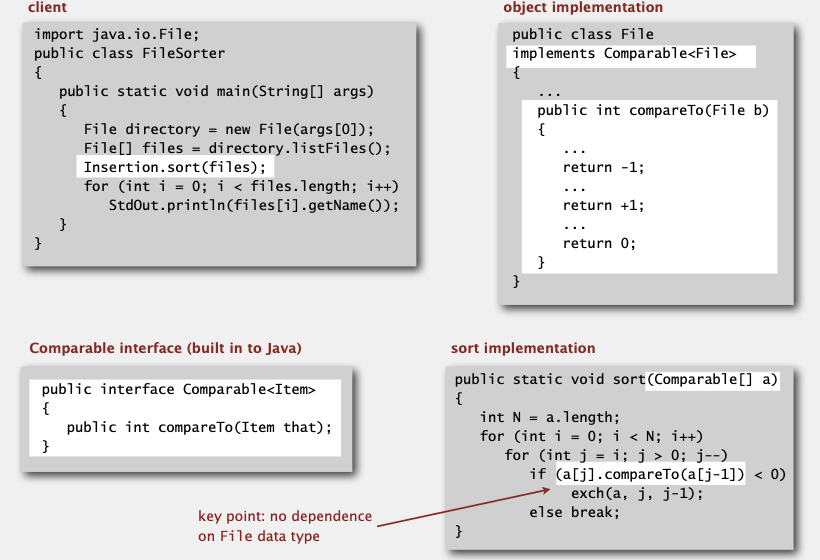
</p>

Definition: A total order is a binary relation ≤ that satisfies:

- Antisymmetry: if v ≤ w and w ≤ v, then v = w.
- Transitivity: if v ≤ w and w ≤ x, then v ≤ x.
- Totality: either v ≤ w or w ≤ v or both.

Surprising but true: The <= operator for double is not a total order. (!)

- violates totality: (Double.NaN <= Double.NaN) is false

#### Comparable API

Implement compareTo() so that v.compareTo(w)

- Is a total order.
- Returns a negative integer, zero, or positive integer
  if v is less than, equal to, or greater than w, respectively.
- Throws an exception if incompatible types (or either is null).

Built-in comparable types: Integer, Double, String, Date, File, ...

User-defined comparable types: Implement the Comparable interface.

<p>
  
</p>

Two useful sorting abstractions:

```java
private static boolean less(Comparable v, Comparable w)
{  return v.compareTo(w) < 0;  }
```

```java
private static void exch(Comparable[] a, int i, int j) {
  Comparable swap = a[i];
  a[i] = a[j];
  a[j] = swap;
}
```

#### Testing

Test if an array is sorted.

```java
private static boolean isSorted(Comparable[] a)
{
   for (int i = 1; i < a.length; i++)
      if (less(a[i], a[i-1])) return false;
   return true;
}
```

### Selection sort

- Algorithm:

  - Steps:
    - In iteration i, find index min of smallest remaining entry.
    - Swap a[i] and a[min].
  - Scans from left to right.
    - Move the pointer to the right: i++
    - Identify index of minimum entry on right.
    - Exchange into position.

- Mathematical analysis
  - (N–1) + (N–2) + ... + 1 + 0 ~ N^2 / 2 compares
  - N exchanges

<p>
  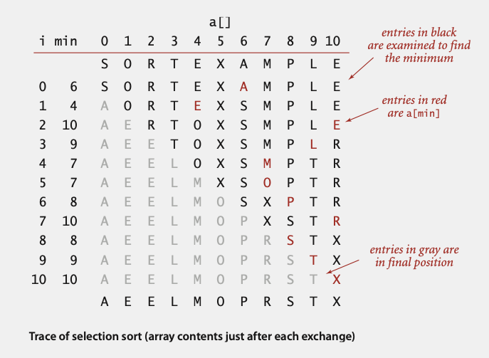
</p>

#### Implementation

<p>
  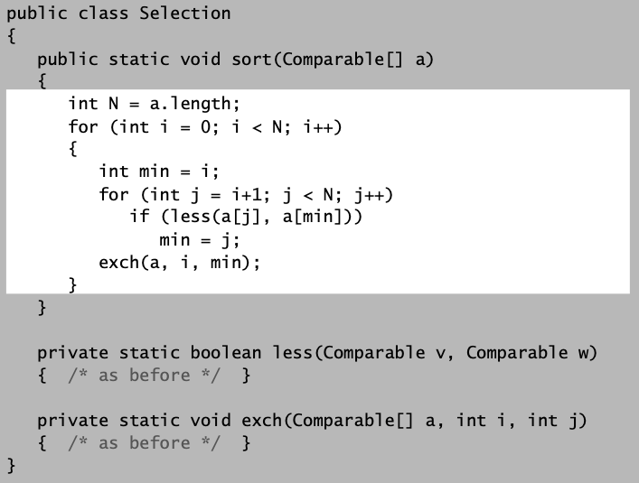
</p>

### Insertion sort

- Algorithm:

  - In iteration i, swap a[i] with **each** larger entry to its left.
  - scans from left to right.
  - Steps:
    - Move the pointer to the right.
    - Moving from right to left, exchange a[i] with each larger entry to its left.

- Mathematical analysis
  - To sort a randomly-ordered array with distinct keys
    - ~ 1⁄4 N^2 compares on average
    - ~ 1⁄4 N^2 exchanges on average
    - (a bit hard to prove it)

<p>
  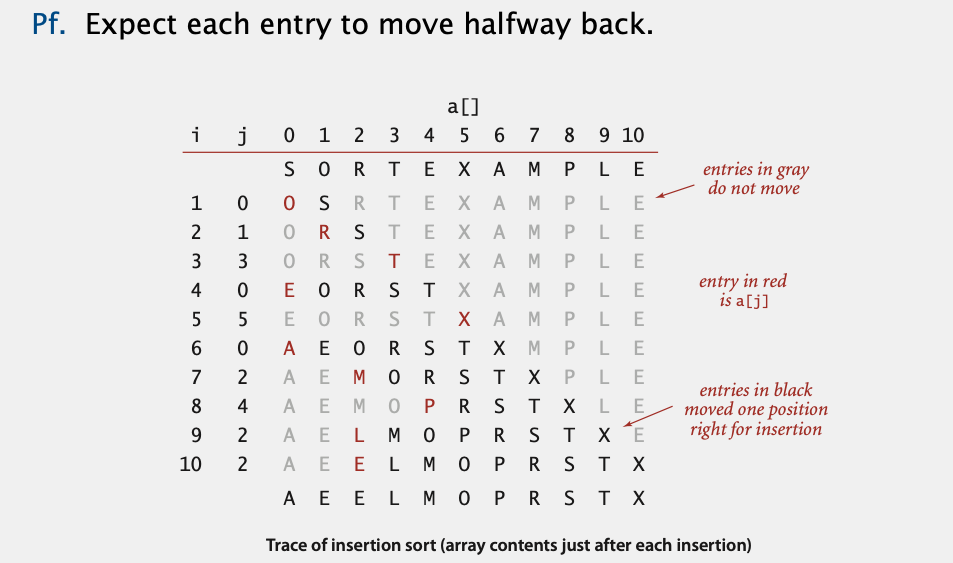
</p>

- Best case.

  - If the array is in ascending order
  - insertion sort makes N - 1 compares
  - 0 exchanges.
  - Ex: `A E E L M O P R S T X`

- Worst case.
  - If the array is in descending order (and no duplicates),
  - insertion sort makes ~ 1⁄2 N^2 compares
  - and ~ 1⁄2 N 2 exchanges.
  - Ex: `X T S R P O M L E E A`

Def: `An inversion is a pair of keys that are out of order.`

- Ex: `A E E L M O T R X P S`
- `T-R T-P T-S R-P X-P X-S`(6 inversions)

Def: An array is partially sorted if the number of inversions is ≤ c N.

- c is a constant
- in other words, an array is partially sorted if the number of inversions is linear
- Ex 1: A subarray of size 10 appended to a sorted subarray of size N.
- Ex 2. An array of size N with only 10 entries out of place.

Proposition: For partially-sorted arrays, insertion sort runs in linear time.

- Pf. Number of exchanges equals the number of inversions.
- number of compares <= exchanges + (N – 1)

#### Implementation

<p>
  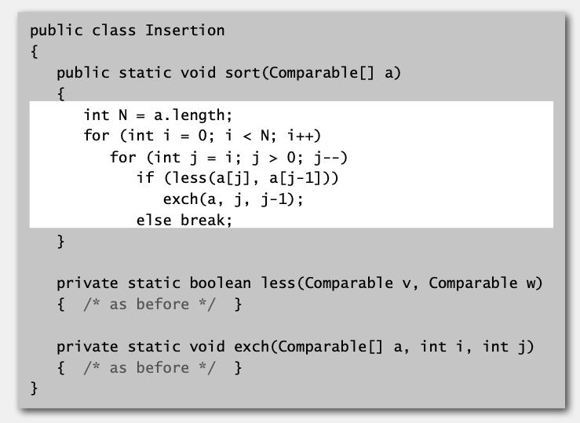
</p>

More info at: https://www.youtube.com/watch?v=ufIET8dMnus

### Shellsort

- Improvement of Insertion Sort
- Idea: Move entries more than one position at a time by h-sorting the array.
- How to h-sort an array? Insertion sort, with stride length h.
- Detailed explanation: https://www.youtube.com/watch?v=ZtjCHnHTK5Q

- Why insertion sort?
  - When the increment is big ⇒ it needs to sort a small sub-array
  - When the increments is small ⇒ the array is nearly in order

Proposition: A g-sorted array remains g-sorted after h-sorting it.

- Challenge. Prove this fact—it's more subtle than you'd think!

Which increment sequence to use?

- Powers of two minus one.
  - 1, 3, 7, 15, 31, 63, ...
  - Maybe.
- **3x + 1**.
  - 1, 4, 13, 40, 121, 364, ...
  - OK. Easy to compute.

#### Implementation

<p>
  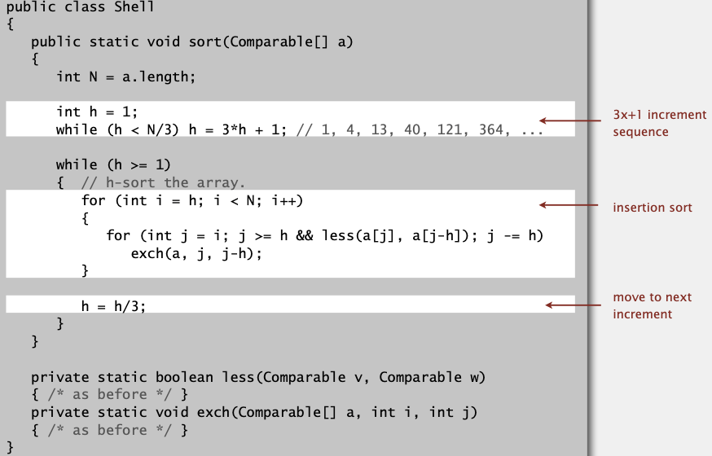
</p>

#### Example

input = `S H E L L S O R T E X A M P L E`

size = 16

h => 3x + 1

- h = 1
- h = 3.h + 1 = 3\*1 + 1 = 4
- h = 3.h + 1 = 3\*4 + 1 = 13
- h = 3.h + 1 = 3\*13 + 1 = 40 => 40 > 16 STOP!

1st h = 13, 2nd h = 4, 3rd h = 1.

**1st step: h = 13**

    0  1  2  3  4  5  6  7  8  9  10 11 12 13 14 15
    S  H  E  L  L  S  O  R  T  E  X  A  M  P  L  E

(0, 13) S - P => Swap

    0  1  2  3  4  5  6  7  8  9  10 11 12 13 14 15
    P  H  E  L  L  S  O  R  T  E  X  A  M  S  L  E

(1, 14) H - L => Do nothing

    0  1  2  3  4  5  6  7  8  9  10 11 12 13 14 15
    P  H  E  L  L  S  O  R  T  E  X  A  M  S  L  E

(2, 15) E - E => Do nothing

    0  1  2  3  4  5  6  7  8  9  10 11 12 13 14 15
    P  H  E  L  L  S  O  R  T  E  X  A  M  S  L  E

**2st step: h = 4**

    0  1  2  3  4  5  6  7  8  9  10 11 12 13 14 15
    P  H  E  L  L  S  O  R  T  E  X  A  M  S  L  E

(0, 4) P - L => Swap

    0  1  2  3  4  5  6  7  8  9  10 11 12 13 14 15
    L  H  E  L  P  S  O  R  T  E  X  A  M  S  L  E

(1, 5) H - S => Do nothing

    0  1  2  3  4  5  6  7  8  9  10 11 12 13 14 15
    L  H  E  L  P  S  O  R  T  E  X  A  M  S  L  E

(2, 6) E - O => Do nothing

    0  1  2  3  4  5  6  7  8  9  10 11 12 13 14 15
    L  H  E  L  P  S  O  R  T  E  X  A  M  S  L  E

(3, 7) L - R => Do nothing

    0  1  2  3  4  5  6  7  8  9  10 11 12 13 14 15
    L  H  E  L  P  S  O  R  T  E  X  A  M  S  L  E

(4, 8) P - T => Do nothing

    0  1  2  3  4  5  6  7  8  9  10 11 12 13 14 15
    L  H  E  L  P  S  O  R  T  E  X  A  M  S  L  E

(5, 9) S - E => Swap

    0  1  2  3  4  5  6  7  8  9  10 11 12 13 14 15
    L  H  E  L  P  E  O  R  T  S  X  A  M  S  L  E

(1, 5) H - E => Swap

    0  1  2  3  4  5  6  7  8  9  10 11 12 13 14 15
    L  E  E  L  P  H  O  R  T  S  X  A  M  S  L  E

(6, 10) O - X => Do nothing

    0  1  2  3  4  5  6  7  8  9  10 11 12 13 14 15
    L  E  E  L  P  H  O  R  T  S  X  A  M  S  L  E

(7, 11) R - A => Swap

    0  1  2  3  4  5  6  7  8  9  10 11 12 13 14 15
    L  E  E  L  P  H  O  A  T  S  X  R  M  S  L  E

(3, 7) L - A => Swap

    0  1  2  3  4  5  6  7  8  9  10 11 12 13 14 15
    L  E  E  A  P  H  O  L  T  S  X  R  M  S  L  E

(8, 12) T - M => Swap

    0  1  2  3  4  5  6  7  8  9  10 11 12 13 14 15
    L  E  E  A  P  H  O  L  M  S  X  R  T  S  L  E

(4, 8) P - M => Swap

    0  1  2  3  4  5  6  7  8  9  10 11 12 13 14 15
    L  E  E  A  M  H  O  L  P  S  X  R  T  S  L  E

(0, 4) L - M => Do nothing

    0  1  2  3  4  5  6  7  8  9  10 11 12 13 14 15
    L  E  E  A  M  H  O  L  P  S  X  R  T  S  L  E

(9, 13) S - S => Do nothing

    0  1  2  3  4  5  6  7  8  9  10 11 12 13 14 15
    L  E  E  A  M  H  O  L  P  S  X  R  T  S  L  E

(10, 14) X - L => Swap

    0  1  2  3  4  5  6  7  8  9  10 11 12 13 14 15
    L  E  E  A  M  H  O  L  P  S  L  R  T  S  X  E

(6, 10) O - L => Swap

    0  1  2  3  4  5  6  7  8  9  10 11 12 13 14 15
    L  E  E  A  M  H  L  L  P  S  O  R  T  S  X  E

(2, 6) E - L => Do nothing

    0  1  2  3  4  5  6  7  8  9  10 11 12 13 14 15
    L  E  E  A  M  H  L  L  P  S  O  R  T  S  X  E

(11, 15) R - E => Swap

    0  1  2  3  4  5  6  7  8  9  10 11 12 13 14 15
    L  E  E  A  M  H  L  L  P  S  O  E  T  S  X  R

(7, 11) L - E => Swap

    0  1  2  3  4  5  6  7  8  9  10 11 12 13 14 15
    L  E  E  A  M  H  L  E  P  S  O  L  T  S  X  R

(3, 7) A - E => Do nothing

    0  1  2  3  4  5  6  7  8  9  10 11 12 13 14 15
    L  E  E  A  M  H  L  E  P  S  O  L  T  S  X  R

**3st step: h = 1 => same as Insertion sort**

    0  1  2  3  4  5  6  7  8  9  10 11 12 13 14 15
    L  E  E  A  M  H  L  E  P  S  O  L  T  S  X  R

(0, 1) L - E => Swap

    0  1  2  3  4  5  6  7  8  9  10 11 12 13 14 15
    E  L  E  A  M  H  L  E  P  S  O  L  T  S  X  R

(1, 2) L - E => Swap

    0  1  2  3  4  5  6  7  8  9  10 11 12 13 14 15
    E  E  L  A  M  H  L  E  P  S  O  L  T  S  X  R

(0, 1) E - E => Do nothing

    0  1  2  3  4  5  6  7  8  9  10 11 12 13 14 15
    E  E  L  A  M  H  L  E  P  S  O  L  T  S  X  R

(2, 3) L - A => Swap

    0  1  2  3  4  5  6  7  8  9  10 11 12 13 14 15
    E  E  A  L  M  H  L  E  P  S  O  L  T  S  X  R

(1, 2) E - A => Swap

    0  1  2  3  4  5  6  7  8  9  10 11 12 13 14 15
    E  A  E  L  M  H  L  E  P  S  O  L  T  S  X  R

(0, 1) E - A => Swap

    0  1  2  3  4  5  6  7  8  9  10 11 12 13 14 15
    A  E  E  L  M  H  L  E  P  S  O  L  T  S  X  R

(3, 4) L - M => Do nothing

    0  1  2  3  4  5  6  7  8  9  10 11 12 13 14 15
    A  E  E  L  M  H  L  E  P  S  O  L  T  S  X  R

(4, 5) M - H => Swap

    0  1  2  3  4  5  6  7  8  9  10 11 12 13 14 15
    A  E  E  L  H  M  L  E  P  S  O  L  T  S  X  R

(3, 4) L - H => Swap

    0  1  2  3  4  5  6  7  8  9  10 11 12 13 14 15
    A  E  E  H  L  M  L  E  P  S  O  L  T  S  X  R

(2, 3) E - H => Do nothing

    0  1  2  3  4  5  6  7  8  9  10 11 12 13 14 15
    A  E  E  H  L  M  L  E  P  S  O  L  T  S  X  R

(5, 6) M - L => Swap

    0  1  2  3  4  5  6  7  8  9  10 11 12 13 14 15
    A  E  E  H  L  L  M  E  P  S  O  L  T  S  X  R

(4, 5) L - L => Do nothing

    0  1  2  3  4  5  6  7  8  9  10 11 12 13 14 15
    A  E  E  H  L  L  M  E  P  S  O  L  T  S  X  R

(6, 7) M - E => Swap

    0  1  2  3  4  5  6  7  8  9  10 11 12 13 14 15
    A  E  E  H  L  L  E  M  P  S  O  L  T  S  X  R

(5, 6) L - E => Swap

    0  1  2  3  4  5  6  7  8  9  10 11 12 13 14 15
    A  E  E  H  L  E  L  M  P  S  O  L  T  S  X  R

(4, 5) L - E => Swap

    0  1  2  3  4  5  6  7  8  9  10 11 12 13 14 15
    A  E  E  H  E  L  L  M  P  S  O  L  T  S  X  R

(3, 4) H - E => Swap

    0  1  2  3  4  5  6  7  8  9  10 11 12 13 14 15
    A  E  E  E  H  L  L  M  P  S  O  L  T  S  X  R

(2, 3) E - E => Do nothing

    0  1  2  3  4  5  6  7  8  9  10 11 12 13 14 15
    A  E  E  E  H  L  L  M  P  S  O  L  T  S  X  R

(7, 8) M - P => Do nothing

    0  1  2  3  4  5  6  7  8  9  10 11 12 13 14 15
    A  E  E  E  H  L  L  M  P  S  O  L  T  S  X  R

(9, 10) S - O => Swap

    0  1  2  3  4  5  6  7  8  9  10 11 12 13 14 15
    A  E  E  E  H  L  L  M  P  O  S  L  T  S  X  R

(8, 9) P - O => Swap

    0  1  2  3  4  5  6  7  8  9  10 11 12 13 14 15
    A  E  E  E  H  L  L  M  O  P  S  L  T  S  X  R

(7, 8) M - O => Do nothing

    0  1  2  3  4  5  6  7  8  9  10 11 12 13 14 15
    A  E  E  E  H  L  L  M  O  P  S  L  T  S  X  R

(10, 11) S - L => Swap

    0  1  2  3  4  5  6  7  8  9  10 11 12 13 14 15
    A  E  E  E  H  L  L  M  O  P  L  S  T  S  X  R

(9, 10) P - L => Swap

    0  1  2  3  4  5  6  7  8  9  10 11 12 13 14 15
    A  E  E  E  H  L  L  M  O  L  P  S  T  S  X  R

(8, 9) O - L => Swap

    0  1  2  3  4  5  6  7  8  9  10 11 12 13 14 15
    A  E  E  E  H  L  L  M  L  O  P  S  T  S  X  R

(7, 8) M - L => Swap

    0  1  2  3  4  5  6  7  8  9  10 11 12 13 14 15
    A  E  E  E  H  L  L  L  M  O  P  S  T  S  X  R

(6, 7) L - L => Do nothing

    0  1  2  3  4  5  6  7  8  9  10 11 12 13 14 15
    A  E  E  E  H  L  L  L  M  O  P  S  T  S  X  R

(11, 12) S - T => Do nothing

    0  1  2  3  4  5  6  7  8  9  10 11 12 13 14 15
    A  E  E  E  H  L  L  L  M  O  P  S  T  S  X  R

(12, 13) T - S => Swap

    0  1  2  3  4  5  6  7  8  9  10 11 12 13 14 15
    A  E  E  E  H  L  L  L  M  O  P  S  S  T  X  R

(11, 12) S - S => Do nothing

    0  1  2  3  4  5  6  7  8  9  10 11 12 13 14 15
    A  E  E  E  H  L  L  L  M  O  P  S  S  T  X  R

(13, 14) T - X => Do nothing

    0  1  2  3  4  5  6  7  8  9  10 11 12 13 14 15
    A  E  E  E  H  L  L  L  M  O  P  S  S  T  X  R

(14, 15) X - R => Swap

    0  1  2  3  4  5  6  7  8  9  10 11 12 13 14 15
    A  E  E  E  H  L  L  L  M  O  P  S  S  T  R  X

(13, 14) T - R => Swap

    0  1  2  3  4  5  6  7  8  9  10 11 12 13 14 15
    A  E  E  E  H  L  L  L  M  O  P  S  S  R  T  X

(12, 13) S - R => Swap

    0  1  2  3  4  5  6  7  8  9  10 11 12 13 14 15
    A  E  E  E  H  L  L  L  M  O  P  S  R  S  T  X

(11, 12) S - R => Swap

    0  1  2  3  4  5  6  7  8  9  10 11 12 13 14 15
    A  E  E  E  H  L  L  L  M  O  P  R  S  S  T  X

(10, 11) P - R => Do nothing

    0  1  2  3  4  5  6  7  8  9  10 11 12 13 14 15
    A  E  E  E  H  L  L  L  M  O  P  R  S  S  T  X

Final result: `A E E E H L L L M O P R S S T X`

### Shuffling

Goal: Rearrange array so that result is a uniformly random permutation.

How to shuffle an array?

#### Shuffle sort

- Generate a random real number for each array entry.
  (useful for shuffling columns in a spreadsheet)
- Sort the array

<p>
  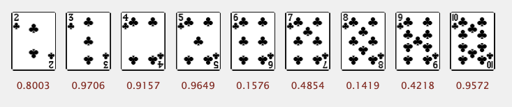
</p>

Proposition: Shuffle sort produces a uniformly random permutation
of the input array, provided no duplicate values.

Drawback: you need to pay the cost of sort

#### Knuth shuffle

Algorithm:

- In iteration i, pick integer r between 0 and i uniformly at random.
- Swap a[i] and a[r].

Attention!

- Common bug: pick integer r between 0 and N – 1
- correct variant: between i and N – 1

```java
public class StdRandom {
  ...
  public static void shuffle(Object[] a) {
    int N = a.length;
    for (int i = 0; i < N; i++) {
      int r = StdRandom.uniform(i + 1); // between 0 and i
      exch(a, i, r);
    }
  }
}
```

Proposition: Knuth shuffling algorithm produces a uniformly random permutation of the input array
in **linear time**.

Best practices for shuffling (if your business depends on it).

- Use a hardware random-number generator that has passed both the FIPS 140-2 and the NIST statistical test suites.
- Continuously monitor statistic properties:
  hardware random-number generators are fragile and fail silently.
- Use an unbiased shuffling algorithm.

### Convex hull

Definition: The convex hull of a set of N points is the smallest perimeter fence enclosing the points.

<p>
  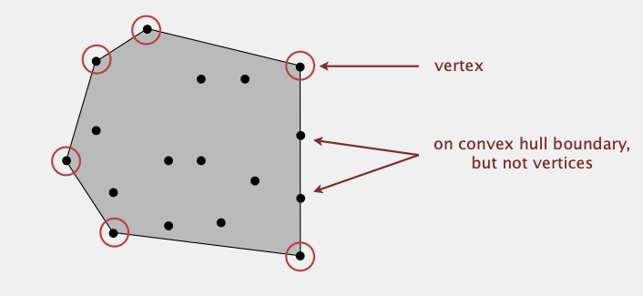
</p>

#### Applications

Motion planning

- Robot motion planning. Find shortest path in the plane from s to t that avoids a polygonal obstacle.

- Fact. Shortest path is either straight line from s to t or it is one of two polygonal chains of convex hull.

<p>
  
</p>

Farthest pair

- Given N points in the plane, find a pair of points with the largest Euclidean distance between them.
- Fact. Farthest pair of points are extreme points on convex hull.

<p>
  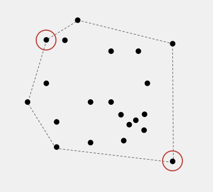
</p>

#### Geometric properties

- Fact. Can traverse the convex hull by making only **counterclockwise** turns.
- Fact. The vertices of convex hull appear in increasing order of polar angle with respect to point p with lowest y-coordinate.

<p>
  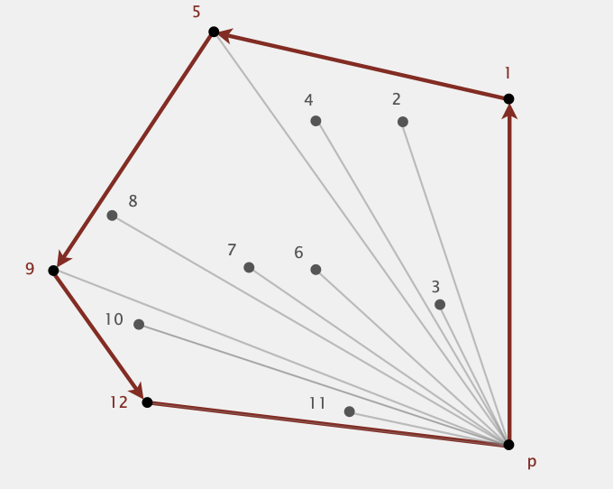
</p>

#### Graham scan

Algorithm to find the Convex hull

Steps:

- Choose point p with smallest y-coordinate.
- Sort points by polar angle with p.
- Consider points in order; discard unless it create a ccw turn.

Implementation challenges

- Q. How to find point p with smallest y-coordinate?
- A. Define a total order, comparing by y-coordinate. [next lecture]

- Q. How to sort points by polar angle with respect to p ?
- A. Define a total order for each point p. [next lecture]

- Q. How to determine whether p1 → p2 → p3 is a counterclockwise turn?
- A. Computational geometry. [next two slides]

- Q. How to sort efficiently?
- A. Mergesort sorts in N log N time. [next lecture]

- Q. How to handle degeneracies (three or more points on a line)?
- A. Requires some care, but not hard. [see booksite]

#### Implementing

CCW. Given three points a, b, and c, is a → b → c a counterclockwise turn?

- If signed area > 0, then a → b → c is counterclockwise.
- If signed area < 0, then a → b → c is clockwise.
- If signed area = 0, then a → b → c are collinear.
- Let's skip the mathematical proof

<p>
  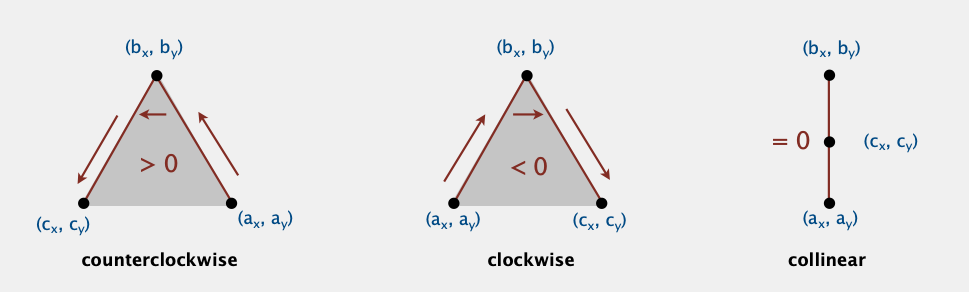
</p>

Lesson: Geometric primitives are tricky to implement.

- Dealing with degenerate cases.
- Coping with floating-point precision.

```java
public class Point2D {
  private final double x;
  private final double y;
  public Point2D(double x, double y) {
    this.x = x;
    this.y = y;
  }
  ...

  public static int ccw(Point2D a, Point2D b, Point2D c) {
    double area2 = (b.x-a.x)*(c.y-a.y) - (b.y-a.y)*(c.x-a.x); // danger of floating-point roundoff error
    if      (area2 < 0) return -1;  // clockwise
    else if (area2 > 0) return +1;  // counter-clockwise
    else                return  0;  // collinear
  }
}
```

#### Question

<p>
  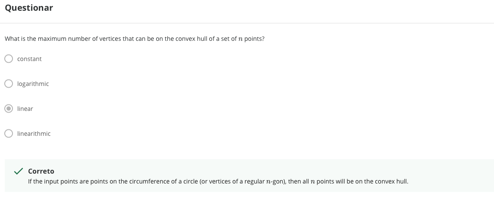
</p>

## 2.2 MERGESORT

### Mergesort

Basic plan:

- Divide array into two halves.
- Recursively sort each half.
- Merge two halves.

#### Implementation

Merge

- Given two sorted subarrays a[lo] to a[mid] and a[mid+1] to a[hi], replace with sorted subarray
  a[lo] to a[hi].

<p>
  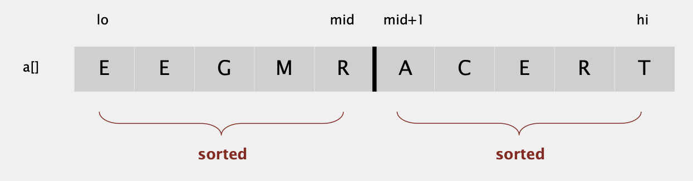
</p>

```java
private static void merge(Comparable[] a, Comparable[] aux, int lo, int mid, int hi) {
  assert isSorted(a, lo, mid);    // precondition: a[lo..mid]   sorted
  assert isSorted(a, mid+1, hi);  // precondition: a[mid+1..hi] sorted

  // copy
  for (int k = lo; k <= hi; k++)
    aux[k] = a[k];

  // merge
  int i = lo, j = mid+1;
  for (int k = lo; k <= hi; k++) {
    if      (i > mid)              a[k] = aux[j++];
    else if (j > hi)               a[k] = aux[i++];
    else if (less(aux[j], aux[i])) a[k] = aux[j++];
    else                           a[k] = aux[i++];
  }

  assert isSorted(a, lo, hi);     // postcondition: a[lo..hi] sorted
}
```

Java assert statement

- Throws exception unless boolean condition is true.
- Can enable or disable at runtime. ⇒ No cost in production code.

```shell
java -ea MyProgram   // enable assertions
java -da MyProgram   // disable assertions (default)
```

```java
pubic class Merge {
  private static void merge(...) {
     /* as before */
  }

  private static void sort(Comparable[] a, Comparable[] aux, int lo, int hi) {
      if (hi <= lo) return;
      int mid = lo + (hi - lo) / 2;
      sort(a, aux, lo, mid);
      sort(a, aux, mid+1, hi);
      merge(a, aux, lo, mid, hi);
  }

  public static void sort(Comparable[] a) {
      aux = new Comparable[a.length];
      sort(a, aux, 0, a.length - 1);
   }
}
```

<p>
  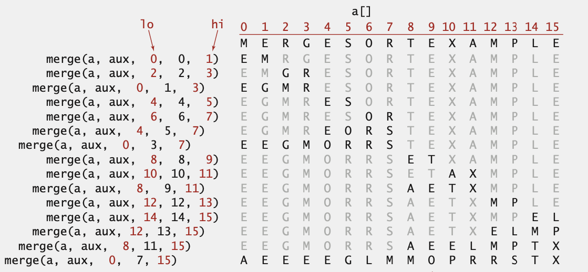
</p>

#### Mathematical analysis

Proposition: Mergesort uses at most N lg N compares and 6 N lg N array accesses to sort any array
of size N.

[assuming N is a power of 2]

<p>
  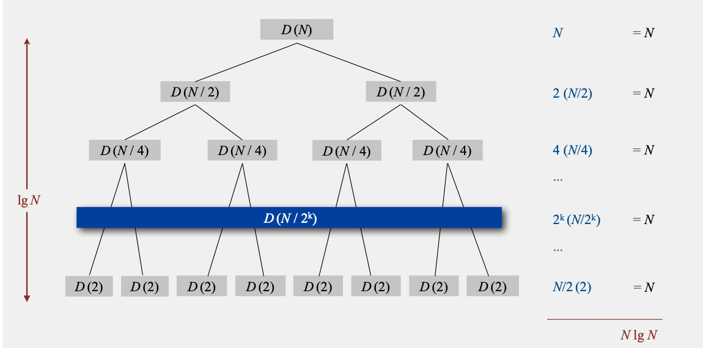
</p>

Proposition. Mergesort uses extra space proportional to N.

- Pf. The array aux[] needs to be of size N for the last merge.

<p>
  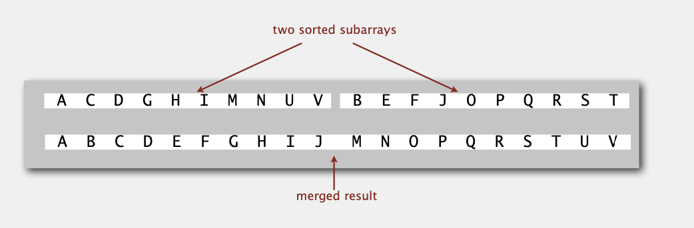
</p>

Definitions: A sorting algorithm is `in-place` if it uses ≤ c log N extra memory. Ex. Insertion sort, selection sort, shellsort.

#### Practical Improvements

1. Use insertion sort for small subarrays.

- Mergesort has too much overhead for tiny subarrays.
- Cutoff to insertion sort for ≈ 7 items.

```java
ate static void sort(Comparable[] a, Comparable[] aux, int lo, int hi) {
  if (hi <= lo + CUTOFF - 1) {
    Insertion.sort(a, lo, hi);
    return;
  }
  int mid = lo + (hi - lo) / 2;
  sort (a, aux, lo, mid);
  sort (a, aux, mid+1, hi);
  merge(a, aux, lo, mid, hi);
}
```

2. Stop if already sorted.

- Is biggest item in first half ≤ smallest item in second half?
- Helps for partially-ordered arrays.

```java
private static void sort(Comparable[] a, Comparable[] aux, int lo, int hi) {
   if (hi <= lo) return;
   int mid = lo + (hi - lo) / 2;
   sort (a, aux, lo, mid);
   sort (a, aux, mid+1, hi);
   if (!less(a[mid+1], a[mid])) return; // HERE!!
   merge(a, aux, lo, mid, hi);
}
```

3. Eliminate the copy to the auxiliary array.

- Save time (but not space) by switching the role of the input and auxiliary array in each
  recursive call.

```java
private static void merge(Comparable[] a, Comparable[] aux, int lo, int mid, int hi) {
  int i = lo, j = mid+1;
  for (int k = lo; k <= hi; k++) {
    if      (i > mid)          aux[k] = a[j++];
    else if (j > hi)           aux[k] = a[i++];
    else if (less(a[j], a[i])) aux[k] = a[j++];
    else                       aux[k] = a[i++];
  }
}

private static void sort(Comparable[] a, Comparable[] aux, int lo, int hi) {
   if (hi <= lo) return;
   int mid = lo + (hi - lo) / 2;
   sort (aux, a, lo, mid);
   sort (aux, a,  mid+1, hi);
   merge(a, aux, lo, mid, hi); // switch roles of aux[] and a[]
}
```

Note: `sort(a)` initializes `aux[]` and sets `aux[i] = a[i]` for each `i`.

#### Question

<p> 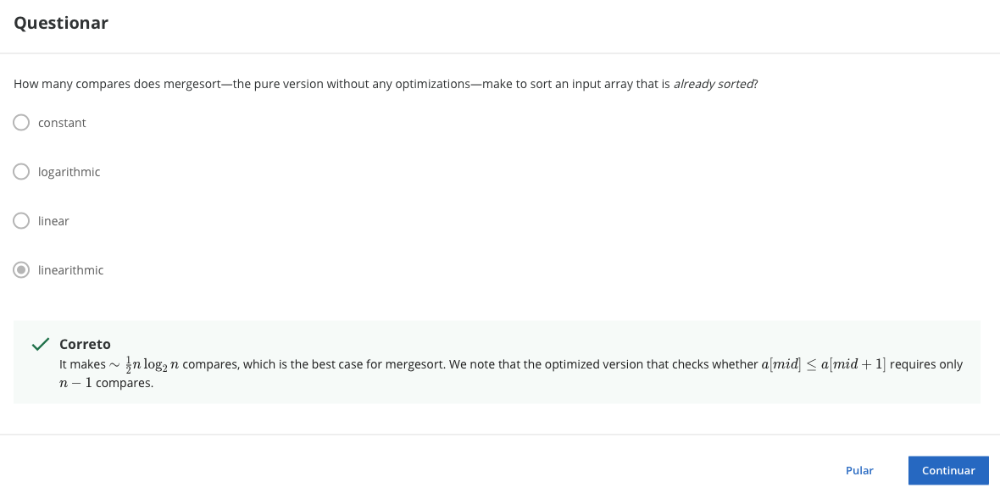 </p>

### Bottom-up mergesort

Basic plan:

- Pass through array, merging subarrays of size 1.
- Repeat for subarrays of size 2, 4, 8, 16, ....

<p> 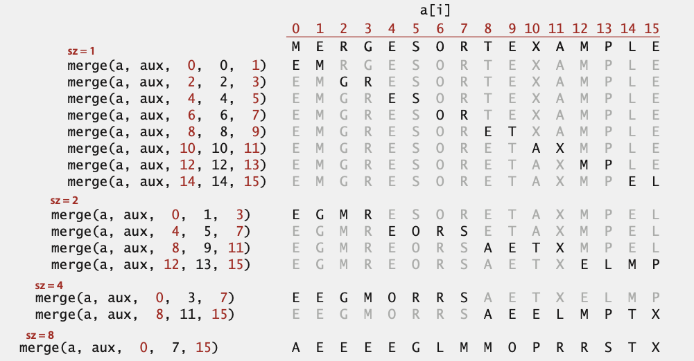 </p>

#### Implementation

```java
public class MergeBU {
  private static void merge(...) {  /* as before */  }
  public static void sort(Comparable[] a) {
    int N = a.length;
    Comparable[] aux = new Comparable[N];
    for (int sz = 1; sz < N; sz = sz+sz)
      for (int lo = 0; lo < N-sz; lo += sz+sz)
        merge(a, aux, lo, lo+sz-1, Math.min(lo+sz+sz-1, N-1));
  }
}
```

Bottom line: Simple and non-recursive version of mergesort.

- Still N Log N
- But about 10% slower than recursive, top-down mergesort on typical systems
- Downside: It uses extra space proportional to N

#### Question

<p> 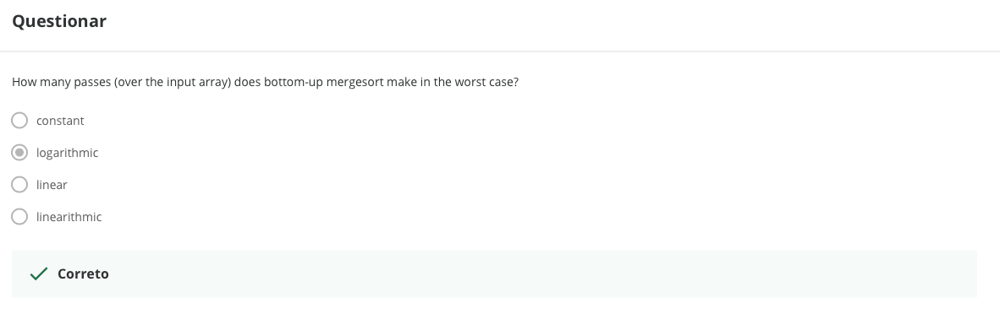 </p>

### Sorting Complexity

Upper Bound

- By an upper bound of Un for some problem and some length n, we mean that `there exists` an
  algorithm A that `for every` input x of length n costs `at most` Un.
- The maximum guaranteed

Lower Bound

- By a lower bound of Ln for some problem and some length n, we mean that `for any` algorithm A
  `there exists` an input x of length n on which A costs `at least` Ln steps.
- The minimum guaranteed

The `Big-O` notation defines the `upper bound` of an algorithm.

- The maximum guaranteed - even in the worst-case scenario.Worst case.

Optimal algorithm

- Upper bound same as its lower bound
- (U(n)=L(n))

Computational complexity: Framework to study efficiency of algorithms for solving a particular
problem X.

- Model of computation: Allowable operations.
- Cost model: Operation count(s).
- Upper bound: Cost guarantee provided by some algorithm for X.
- Lower bound: Proven limit on cost guarantee of all algorithms for X.
- Optimal algorithm: Algorithm with best possible cost guarantee for X.

Example: sorting

- Model of computation: decision tree.
- Cost model: # compares.
- Upper bound: ~ N lg N from mergesort.
- Lower bound: ?
- Optimal algorithm: ?

<p> 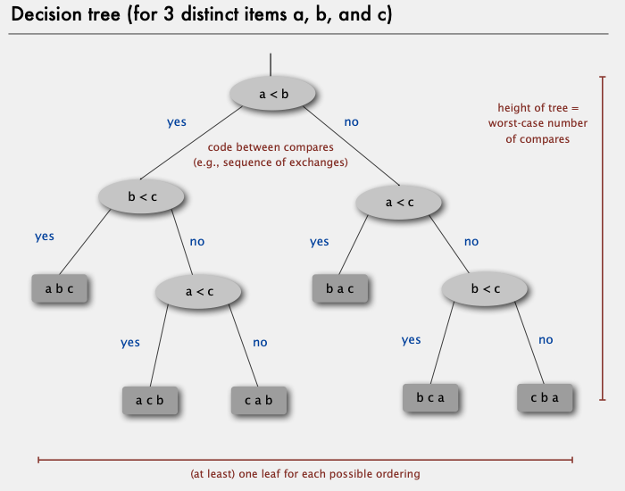 </p>

Proposition: Any compare-based sorting algorithm must use at least lg ( N ! ) ~ N lg N compares
in the worst-case.

- Proof:
  - Assume array consists of N distinct values a1 through aN.
  - Worst case dictated by height `h` of decision tree.
  - Binary tree of height `h` has at most `2^h` leaves.
  - N! different orderings ⇒ at least N! leaves.

```
2^h ≥ #leaves ≥ N!
⇒ h ≥ lg ( N ! ) ~ N lg N
⇒ h ≥ N lg N (Stirling's formula: lg ( N ! ) ~ N lg N)
```

Example: sorting.

- Model of computation: decision tree.
- Cost model: # compares.
- Upper bound: ~ N lg N from mergesort.
- Lower bound: ~ N lg N.
- Optimal algorithm = mergesort.

First goal of algorithm design: optimal algorithms.

Complexity results in context

- Compares? Mergesort is optimal with respect to number compares.
- Space? Mergesort is not optimal with respect to space usage.
- Lower bound may not hold if the algorithm has information about:
  - The initial order of the input.
  - The distribution of key values.
  - The representation of the keys.

Partially-ordered arrays: Depending on the initial order of the input,
we may not need N lg N compares. (insertion sort requires only N-1 compares if input array is
sorted)

Duplicate keys: Depending on the input distribution of duplicates, we may not need N lg N compares.
(stay tuned for 3-way quicksort)

Digital properties of keys: We can use digit/character compares instead of
key compares for numbers and strings. (stay tuned for radix sorts)

#### Question

<p> 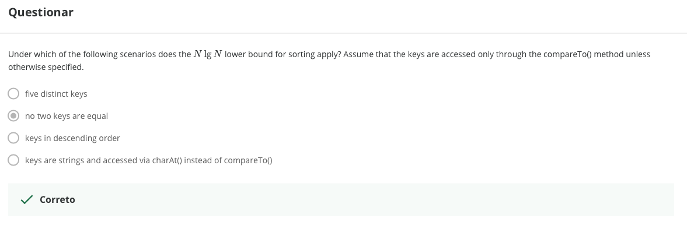 </p>

### Comparators

Comparable interface: sort using a type's `natural order`.

Comparator interface: sort using an `alternate order`.

<p> 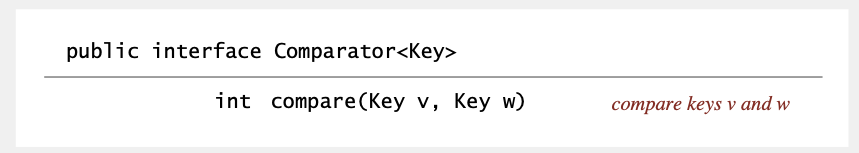 </p>

Required property: Must be a total order.

Example: Sort strings by:

- Natural order: `Now is the time`
- Case insensitive: `is Now the time`
- Spanish: `café cafetero cuarto churro nube ñoño`
- British phone book: `McKinley Mackintosh`
- ...

To use with Java system sort:

- Create Comparator object.
- Pass as second argument to Arrays.sort().

<p> 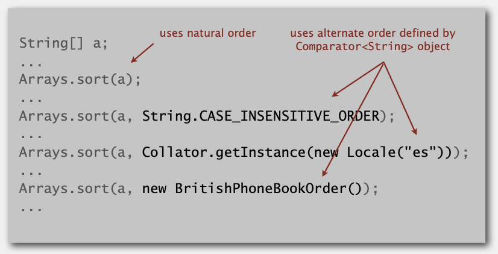 </p>

Bottom line: Decouples the definition of the data type from the definition of what it means to
compare two objects of that type.

To support comparators in our sort implementations:

- Use Object instead of Comparable.
- Pass Comparator to sort() and less() and use it in less().

<p> 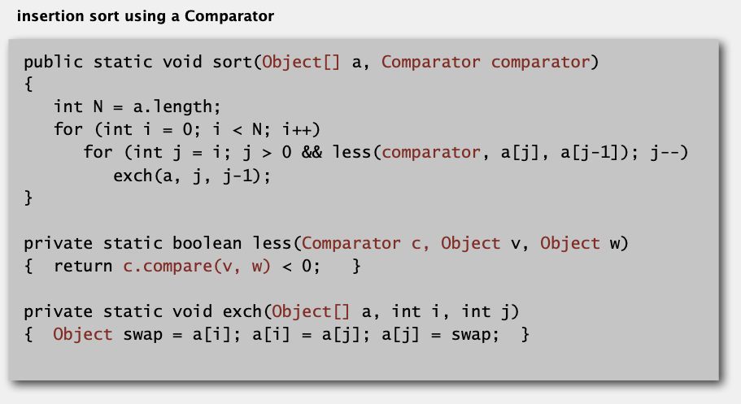 </p>

To implement a comparator:

- Define a (nested) class that implements the Comparator interface.
- Implement the compare() method.

<p> 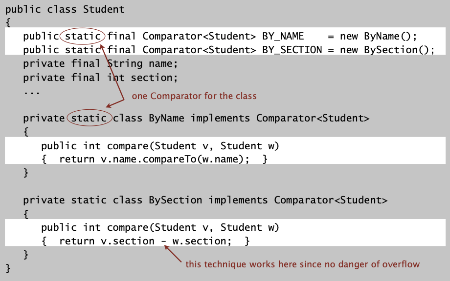 </p>

#### Polar order

Polar order: Given a point p, order points by polar angle they make with p.

- Application. Graham scan algorithm for convex hull. [see previous lecture]

<p> 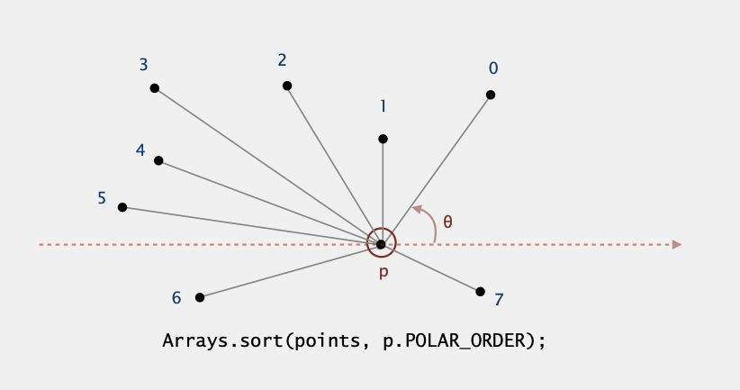 </p>

A ccw-based solution:

- If q1 is above p and q2 is below p, then q1 makes smaller polar angle.
- If q1 is below p and q2 is above p, then q1 makes larger polar angle.
- Otherwise, ccw(p, q1, q2) identifies which of q1 or q2 makes larger angle.

<p> 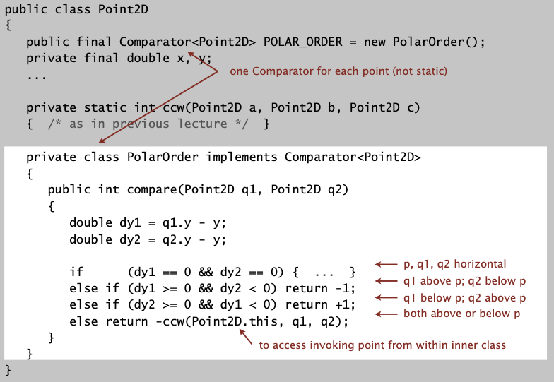 </p>

#### Question

<p> 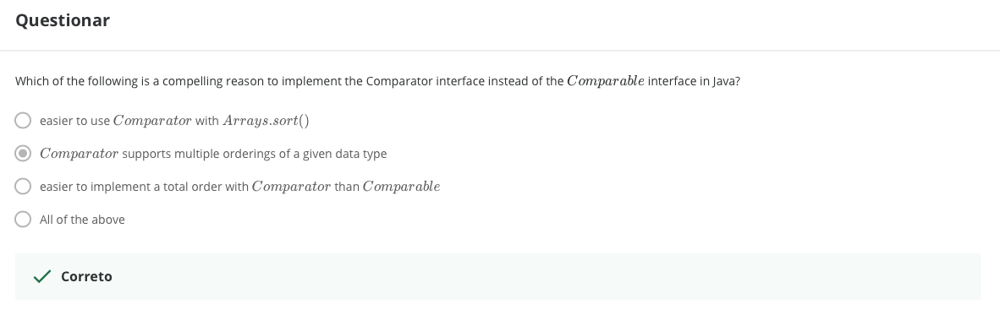 </p>

### Stability

A typical application: First, sort by name; `then` sort by section.

Definition: A `stable sort` preserves the relative order of items with equal keys.

Which sorts are stable?

- Insertion sort and mergesort (but not selection sort or shellsort).

<p> 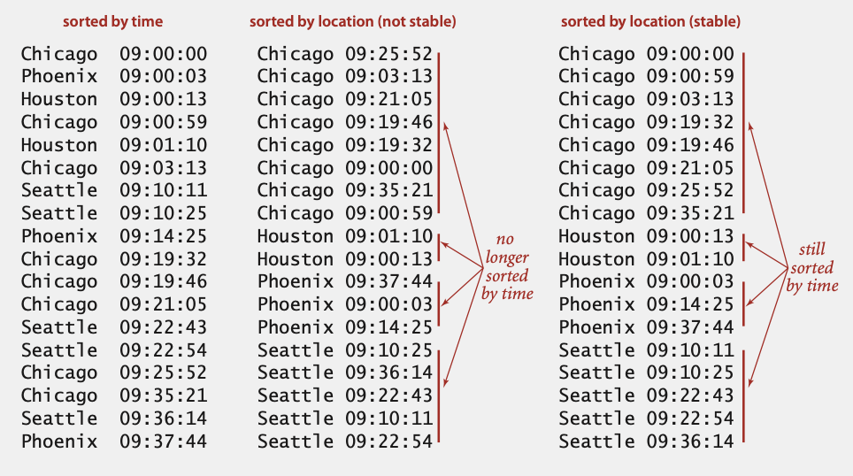 </p>

Note: Need to carefully check code ("less than" vs. "less than or equal to").

#### Stability: insertion sort

Proposition: Insertion sort is stable.

- Proof: Equal items never move past each other.

```java
public class Insertion {
  public static void sort(Comparable[] a) {
    int N = a.length;
    for (int i = 0; i < N; i++)
  }
}
```

<p> 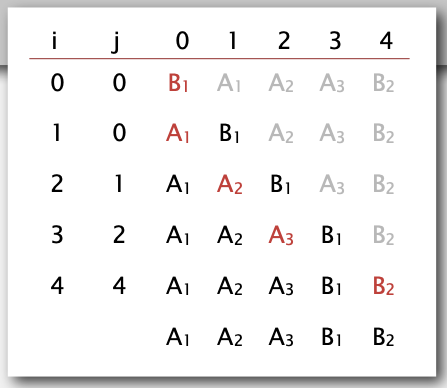 </p>

#### Stability: selection sort

Proposition: Selection sort is not stable.

- Proof by counterexample. Long-distance exchange might move an item past some equal item.

```java
public  class Selection {
  public static void sort(Comparable[] a) {
    int N = a.length;
    for (int i = 0; i < N; i++) {
      int min = i;
      for (int j = i+1; j < N; j++)
        if (less(a[j], a[min]))
            min = j;
      exch(a, i, min);
    }
  }
}
```

<p> 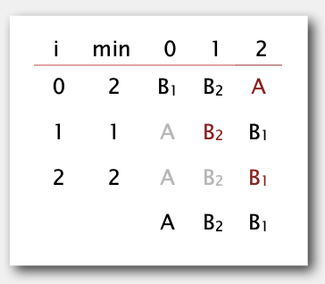 </p>

#### Stability: shellsort

Proposition: Shellsort sort is not stable.

- Pf by counterexample. Long-distance exchanges.

```java
pubic class Shell {
  public static void sort(Comparable[] a) {
    int N = a.length;
    int h = 1;
    while (h < N/3) h = 3*h + 1;
    while (h >= 1) {
      for (int i = h; i < N; i++) {
        for (int j = i; j > h && less(a[j], a[j-h]); j -= h)
            exch(a, j, j-h);
      }
      h = h/3; }
  }
}
```

<p> 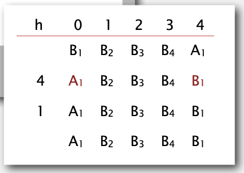 </p>

#### Stability: mergesort

Proposition: Mergesort is stable.

- Proof: Suffices to verify that merge operation is stable.

```java
public class Merge {
  private static Comparable[] aux;
  private static void merge(Comparable[] a, int lo, int mid, int hi) {
    /* as before */
  }

  private static void sort(Comparable[] a, int lo, int hi) {
    if (hi <= lo) return;
    int mid = lo + (hi - lo) / 2;
    sort(a, lo, mid);
    sort(a, mid+1, hi);
    merge(a, lo, mid, hi);
  }
  public static void sort(Comparable[] a) {  /* as before */  }
}
```

- Proof: Takes from left subarray if equal keys.

```java
private static void merge(...) {
  for (int k = lo; k <= hi; k++)
    aux[k] = a[k];

  int i = lo, j = mid+1;
  for (int k = lo; k <= hi; k++) {
    if      (i > mid)              a[k] = aux[j++];
    else if (j > hi)               a[k] = aux[i++];
    else if (less(aux[j], aux[i])) a[k] = aux[j++];
    else                           a[k] = aux[i++];
  }
}
```

<p> 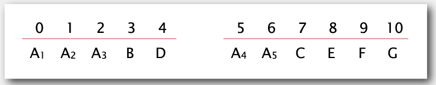 </p>

#### Question

<p> 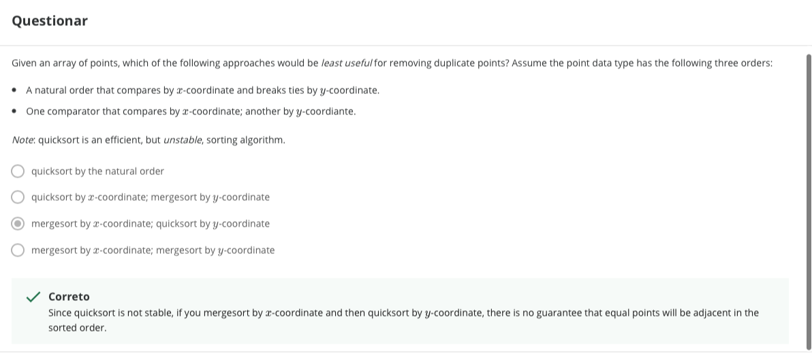 </p>
