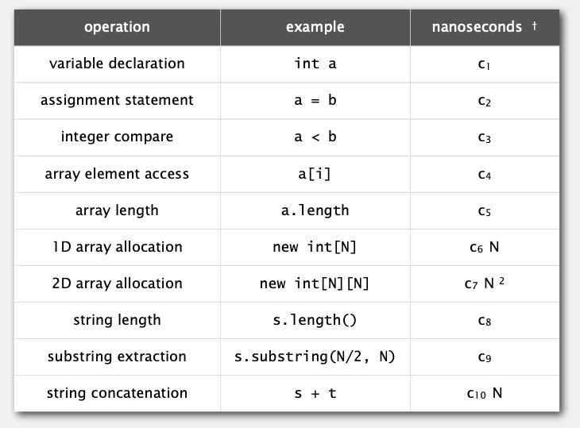
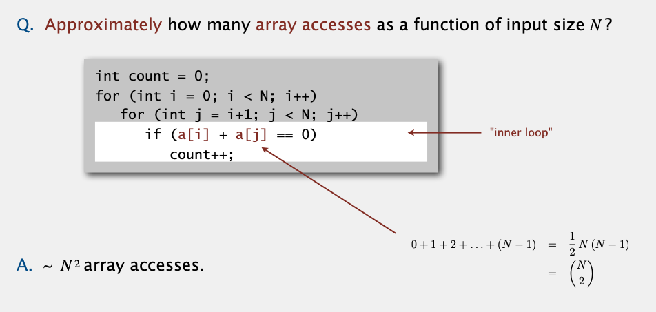
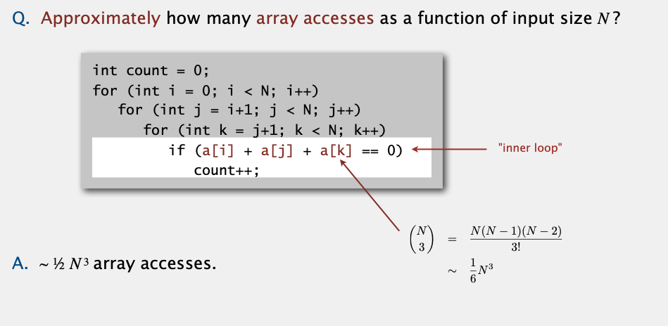
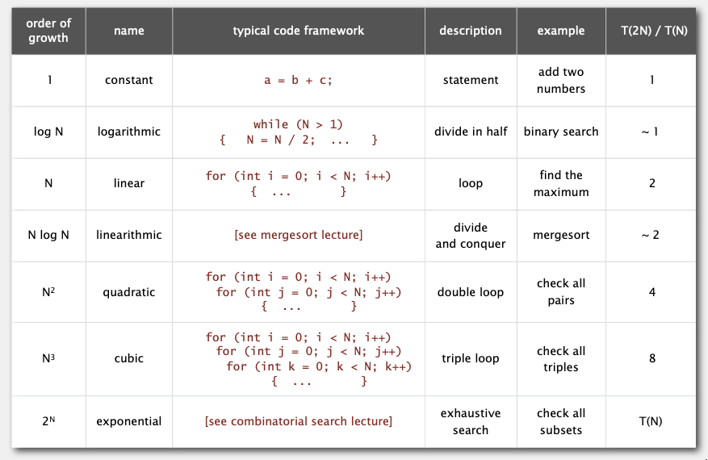
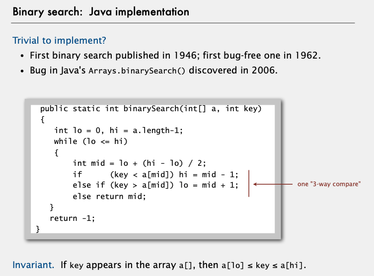
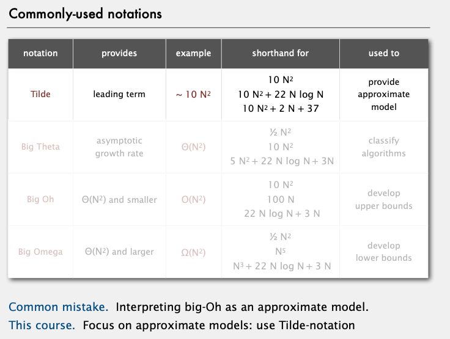
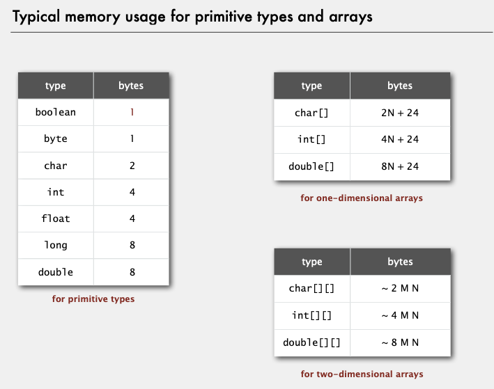
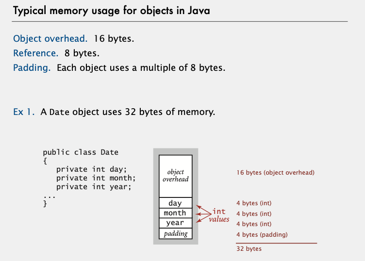
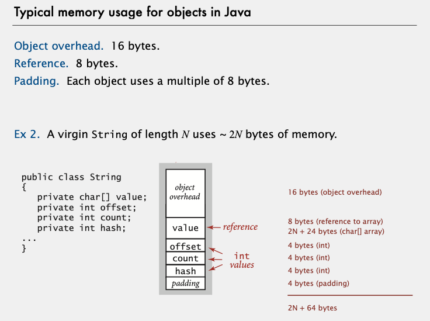

# Notes - Algorithms, Part I

## 1.5 UNION-FIND

Steps to developing a usable algorithm.

- Model the problem.
- Find an algorithm to solve it.
- Fast enough? Fits in memory?
- If not, figure out why.
- Find a way to address the problem. - Iterate until satisfied.

The scientific method. Mathematical analysis.

### Dynamic connectivity

Given a set of N objects.

- Union command: connect two objects.
- Find/connected query: is there a path connecting the two objects?

Modeling the objects

When programming, convenient to name objects 0 to N –1.

- Use integers as array index.
- Suppress details not relevant to union-find.

We assume "is connected to" is an equivalence relation:

- Reflexive: p is connected to p.
- Symmetric: if p is connected to q, then q is connected to p.
- Transitive: if p is connected to q and q is connected to r, then p is connected to r.

#### Quick Find

Data structure.

- Integer array id[] of length N.
- Interpretation: p and q are connected iff they have the same id

Methods

- init: set id of each object to itself (N array accesses)
- connected: check if p and q have the same id. (2 array accesses)
- union: To merge components containing p and q, change all entries whose id equals id[p] to id[q]
  (at most 2N + 2 array accesses)

| algorithm  | initialize | union | find |
| ---------- | ---------- | ----- | ---- |
| quick-find | N          | N     | 1    |
|            |            |       |      |

Union is too expensive. It takes N 2 array accesses to process a sequence of
N union commands on N objects

#### Quick Union [lazy approach]

Data structure

- Integer array id[] of length N.
- Interpretation: id[i] is parent of i.
- Root of i is id[id[id[...id[i]...]]].

Methods

- init: set id of each object to itself (N array accesses)
- root (private): chase parent pointers until reach root (depth of i array accesses)
- connected: Check if p and q have the same root.
- union: To merge components containing p and q, set the id of p's root to the id of q's root.
  (depth of p and q array accesses)

| algorithm   | initialize | union | find |
| ----------- | ---------- | ----- | ---- |
| quick-find  | N          | N     | 1    |
| quick-union | N          | N †   | N    |

† includes cost of finding roots

Quick-find defect.

- Union too expensive (N array accesses).
- Trees are flat, but too expensive to keep them flat.

Quick-union defect.

- Trees can get tall.
- Find too expensive (could be N array accesses).

#### Quick-Union Improvements

Improvement 1: weighting

Weighted quick-union.

- Modify quick-union to avoid **tall trees**.
- Keep track of size of each tree (number of objects).
- Balance by linking root of smaller tree to root of larger tree.

Data structure:

- Integer array id[] of length N.
- Integer array sz[] of length N to count number of objects in the tree rooted
  at i

Methods:

- init: same as quick-union, but creating the extra array sz[] and set sz of each object to 1.
- root (private): same as quick-union
- connected: identical to quick-union. return root(p) == root(q);
- union: Modify quick-union to:
  - Link root of smaller tree to root of larger tree.
  - Update the sz[] array.

Running time

- Find: takes time proportional to depth of p and q.
- Union: takes constant time, given roots.

**Proposition: Depth of any node x is at most lg N.**

| algorithm   | initialize | union  | find |
| ----------- | ---------- | ------ | ---- |
| quick-find  | N          | N      | 1    |
| quick-union | N          | N †    | N    |
| weighted QU | N          | lg N † | lg N |

† includes cost of finding roots

Improvement 2: path compression

Simpler one-pass variant: Make every other node in path point to its
grandparent (thereby halving path length).

In practice. No reason not to! Keeps tree almost completely flat.

Proposition. [Hopcroft-Ulman, Tarjan]:

Starting from an empty data structure, any sequence of M union-find ops on N objects
makes ≤ c ( N + M lg\* N ) array accesses.

- Analysis can be improved to N + M α(M, N).
- Simple algorithm with fascinating mathematics

Linear-time algorithm for M union-find ops on N objects?

- Cost within constant factor of reading in the data.
- In theory, WQUPC is not quite linear.
- In practice, WQUPC is linear.

Bottom line: Weighted quick union (with path compression) makes it
possible to solve problems that could not otherwise be addressed.

| algorithm                      | worst-case time |
| ------------------------------ | --------------- |
| quick-find                     | M N             |
| quick-union                    | M N             |
| weighted QU                    | N + M log N     |
| QU + path compression          | N + M log N     |
| weighted QU + path compression | N + M lg\* N    |

\* M union-find operations on a set of N objects

Ex. [10^9 unions and finds with 10^9 objects]
・WQUPC reduces time from 30 years to 6 seconds.
・Supercomputer won't help much; good algorithm enables solution.

### Percolation Assignment

- We model a percolation system using an n-by-n grid of sites
- Each site is either open or blocked
- A full site:
  - open site
  - can be connected to an open site in the top row via a chain of
    neighboring (left, right, up, down) open sites.
- We say the system percolates if:
  - There is a full site in the bottom row
  - In other words, a system percolates if we fill all open sites connected to the top row and that
    process fills some open site on the bottom row

## 1.4 ANALYSIS OF ALGORITHMS

### Cost of basic operations

  

  

  

  

### Common order-of-growth classifications

  

### Binary search: Java implementation

  

### Commonly-used notations

  

### Typical memory usage for primitive types and arrays

  

### Typical memory usage for objects in Java

  

  

Total memory usage for a data type value:

- Primitive type: 4 bytes for int, 8 bytes for double, ...
- Object reference: 8 bytes.
- Array: 24 bytes + memory for each array entry.
- Object: 16 bytes + memory for each instance variable
  \+ 8 bytes if inner class (for pointer to enclosing class).
- Padding: round up to multiple of 8 bytes.

Shallow memory usage: Don't count referenced objects.

Deep memory usage: If array entry or instance variable is a reference, add memory (recursively) for referenced object.
